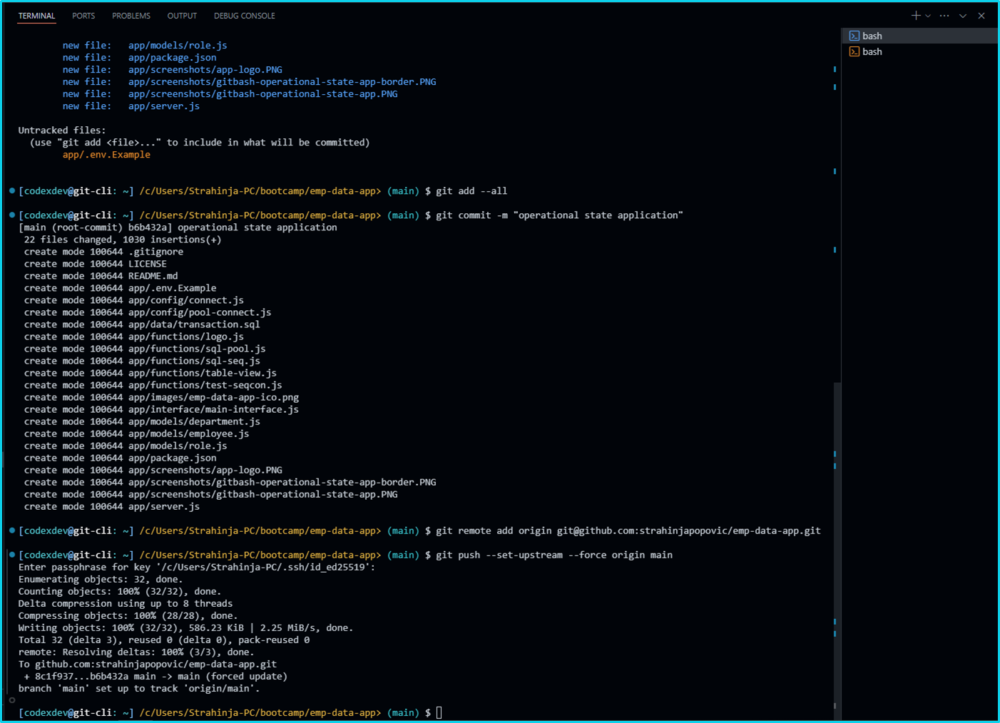

# emp-data-app

## Employee Data Application
     

[](https://opensource.org/licenses/MIT) 

<p align="left">
    
    
    
    
    
<p align="left">
    <a href="https://gist.github.com/Julien-Marcou/156b19aea4704e1d2f48adafc6e2acbf"></a>
    <a href="https://nodejs.org/en"></a>
    <a href="https://docs.npmjs.com/about-npm#getting-started"></a>
    <a href="https://www.npmjs.com/package/inquirer"></a>
    <a href="https://www.npmjs.com/package/json5"></a>
</p>

<p align="left">
    <a href="https://twitter.com/stanpopovic"></a>
    <a href="https://www.youtube.com/@strahinja-popovic-ch"></a>
</p>

## Employee data application with `node.js v22.0.0`, `npm-v10.5.2`, `inquirer-v8.2.4` and `postgresql-v8.11.5`

<a id="table-of-content"></a>
## Table of Content (TOC)

- [Table of Content](#table-of-content)
- [Description Info](#description-info)
- [GitHub Repository](#github-repository)
- [Installation Process](#installation-process)
- [Usage Info](#usage-info)
- [Contributing Guidelines](#contributing-guidelines)
- [Test Instructions](#test-instructions)
- [Demonstration on YouTube](#demonstration-on-youtube)
- [License](#license)
- [Questions and Contacts](#questions-and-contacts)

<a id="description-info"></a>
## Description Info

Application `emp-data-app` or Employee Data Application is a small command line interface that faciliate connection between user inputs and database transactions. It provides some operations like CRUD on departments, roles and employees records. 

<a id="github-repository"></a>
## GitHub Repository 
[](https://github.com/strahinjapopovic/emp-data-app)

### Application Logo 
[](./app/screenshots/app-logo.PNG)

## Git Bash Terminal setting up origin main
[](./app/screenshots/gitbash-operational-state-dir.PNG)

<a id="installation-process"></a>
## Installation Process
### Because we need PostgreSQL database it should be installed at local machine drive and then loaded into npm node module packages. Installation process for postgresql we can find here [PostgreSQL Databse Installation](https://www.enterprisedb.com/downloads/postgres-postgresql-downloads). During the installation process default port should be `5432`. After database is installed localy npm pg packages should be loaded into node modules over cli terminal.

```bash
$ npm install pg
```
After packages are loaded database credentials should be populated into `.env` file like username, password, database host and database name. Check .env file for details. Also, there is a file `~data/transaction.sql` that can be used to set database structure and to populate database with testing seeds. Check file `transaction.sql`. It can be runned as follows:

```console
$ psql -U postgres # it should prompt ypur password for username postgres and insert password
Password for user postgres:
psql (16.2)
postgres=# \i ./data/transaction.sql
DROP DATABASE
CREATE DATABASE
You are now connected to database "emp_db" as user "postgres".
psql:data/transaction.sql:11: NOTICE:  table "department" does not exist, skipping
DROP TABLE
psql:data/transaction.sql:12: NOTICE:  table "role" does not exist, skipping
DROP TABLE
psql:data/transaction.sql:13: NOTICE:  table "employee" does not exist, skipping
CREATE TABLE
CREATE TABLE
INSERT 0 5
INSERT 0 8
INSERT 0 4
INSERT 0 8
emp_db=#
```

<a id="usage-info"></a>
## Usage Info

As a small application it can be helpful for testing and practising purpose but on the other side it has some atributes of serious programming application.

<a id="contributing-guidelines"></a>
## Contributing Guidelines

Currentlly, at this stage there is no contributors but for more information any enquiry can be reffered to Question and Contact section.

<a id="test-instructions"></a>
## Test Instructions

Application runs by invoking command `$ npm start` at `~/emp-data-app/app>` directory. Before running application, download compressed repo from githaub and installl packages globaly or at application root directory from the section [Installation Process](#installation-process). 

<a id="demonstration-on-youtube"></a>
## Demonstration on [YouTube](https://youtu.be/BEtY4kz-DL0)

Demonstration of the application can be visited below.

[](https://youtu.be/BEtY4kz-DL0)

## License

Copyright © 2024, [codexdev](https://github.com/strahinjapopovic). Released under the [MIT License](./LICENSE).

<a id="questions-and-contacts"></a>
## Questions and Contacts

Questions about application can be reffered to the author's [GitHub account](https://github.com/strahinjapopovic) or you can [Contact Me](mailto:spope.mails@gmail.com) directly over an email.
